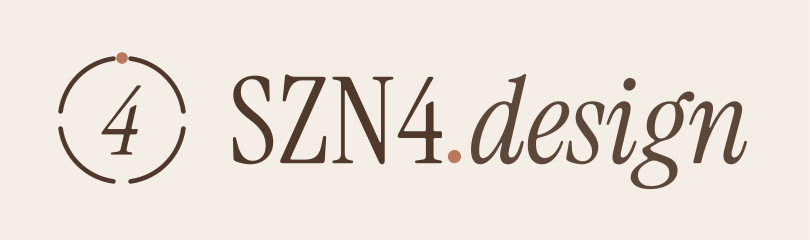

# szn4.design

Source for **[szn4.design](https://www.szn4.design/)**, the portfolio of Sabrina Mohammed, a Toronto-based UX/UI designer who designs ecommerce and product experiences and builds them as working prototypes and Shopify front-ends.

Static, responsive HTML, CSS and JavaScript. No framework, no package install, no build step.

## Case studies

| Project | Focus | Prototype | Code |
|---|---|---|---|
| [FragranceBuy: Deals vs. Discovery](https://www.szn4.design/fragrancebuy-deals-vs-discovery/) | Ecommerce · CRO | [A](https://fragrancebuy-redesign.vercel.app/) · [B](https://fragrancebuy-redesign-protoype-b.vercel.app/) | [A](https://github.com/SZN4Design/Fragrancebuy-redesign) · [B](https://github.com/SZN4Design/Fragrancebuy-redesign-ProtoypeB) |
| [CRVNCHMODE](https://www.szn4.design/crvnchmode-designing-a-smarter-way-to-choose-a-car/) | Automotive · decision UX | [Live](https://crunchmode.vercel.app/) | [Repo](https://github.com/SZN4Design/Crunchmode) |
| [ListIQ](https://www.szn4.design/dealer-listing-optimization-platform/) | B2B · AI-assisted UX | [Live](https://listing-quality-assistant.vercel.app/) | [Repo](https://github.com/SZN4Design/Listing-quality-assistant) |
| [Market Demand Forecaster](https://www.szn4.design/market-demand-forecaster/) | Data visualization | [Live](https://demand-flow-advisor.vercel.app/) | [Repo](https://github.com/SZN4Design/Demand-flow-advisor) |

## Routes

- `/`: animated welcome with a wheel-style scroll intro, then role statement and selected work
- `/about-me/`: story, skills and contact form
- `/ui-ux-projects/`: all case studies
- `/fragrancebuy-deals-vs-discovery/`, `/crvnchmode-designing-a-smarter-way-to-choose-a-car/`, `/dealer-listing-optimization-platform/` (ListIQ), `/market-demand-forecaster/`

The old `/welcome-1`, `/work` and `/projects` routes redirect to their current pages (see `vercel.json`).

## Structure

```
index.html, styles.css, script.js   Welcome page and scroll effect
assets/site.css                     Shared nav (with social icons) and footer
assets/projects.css, projects.js    Work page and case-study pages
assets/brand/                       Logo, mark and favicons
assets/projects/<slug>/             Case-study images
about-me/                           About page, its styles and images
fragrancebuy-deals-vs-discovery/    FragranceBuy case study (own styles and script)
```

## Brand

- **Colours:** Espresso `#4E392C`, Deep `#2E241E`, Cream `#F4EEE6`, Sand `#C8B79F`, Clay `#B9785E`
- **Type:** Instrument Serif (headlines, italic for emphasis) and DM Sans (body, labels, nav)
- **Mark:** a "season wheel": four arcs for the four seasons in SZN4, with a dot marking the current one

## Run locally

```bash
python3 -m http.server 8123
# then visit http://localhost:8123
```

Deployed on Vercel from `main` (framework preset: Other, no build command).

## Accessibility

Navigation and content work without JavaScript; scroll effects, the delayed home nav and image dialogs are progressive enhancements. Reduced-motion preferences turn the scroll effects off. Dialogs support keyboard focus and Escape.

## Contact form

The About page form posts to FormSubmit at `sabrina@szn4.design`. Delivery depends on FormSubmit activation for that address.

## A note on data

All four case studies are self-initiated concepts. Scores, forecasts, prices and metrics in the prototypes are illustrative, not measured results.

---

[szn4.design](https://www.szn4.design/) · [LinkedIn](https://www.linkedin.com/in/sabrina-mohammed-31694483/) · [Digital products on Etsy](https://www.etsy.com/ca/shop/SZN4Design) · sabrina@szn4.design
